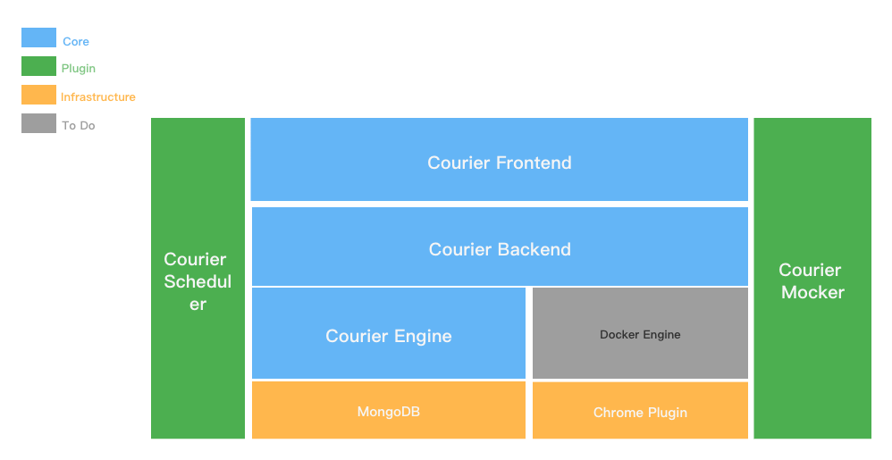
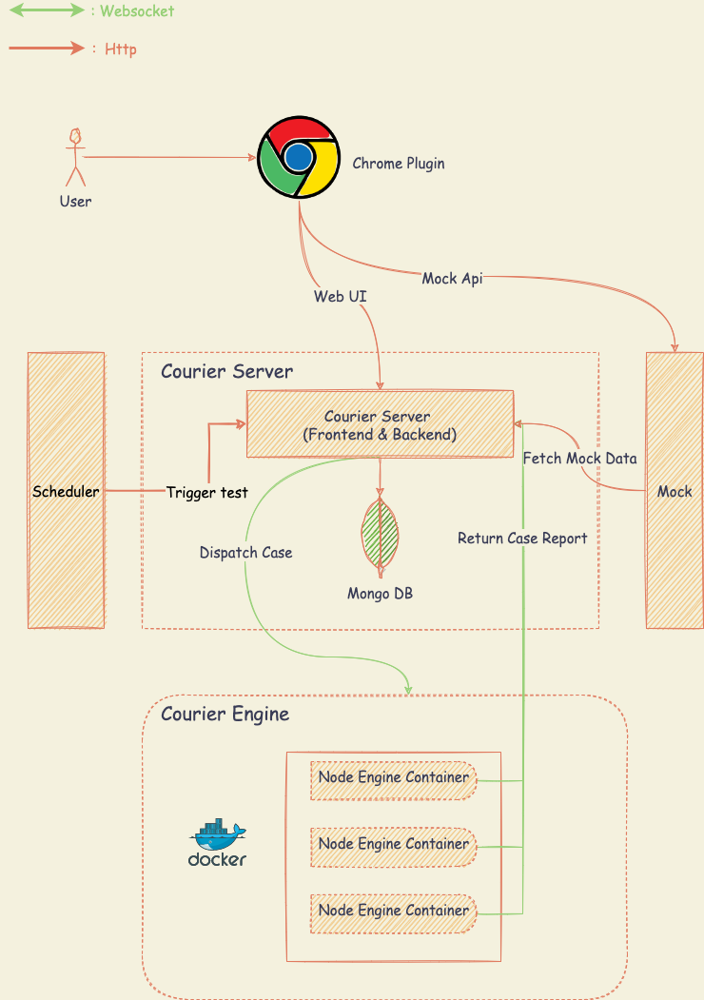

# Courier

Courier is a one-stop open source continuous api test platform, covering Test tracking, Scene test, Interface testing, Api design, Teamwork and other functions, effectively supporting the development and test team to make full use of cloud elasticity to highly scalable automation test, accelerate High quality software delivery.

## Architecture

### Component Description

* Frontend: Front-end project of Courier, Development based on React.
* Backend: The back-end project of Courier, which is developed based on Spring Boot, is the functional main body of Courier.
* Scheduler: Test task scheduling engine.
* Engine: Receive test tasks from the system and test independently in Sandbox
* MongoDB: All the main data of Courier are stored in Mongodb.
* Chrome Plugin: Browser plug-in to test the local interface.
* Docker Engine: Provide a running environment for the engine.
* Mocker: No code simulation test for API.

### Component Relationship
